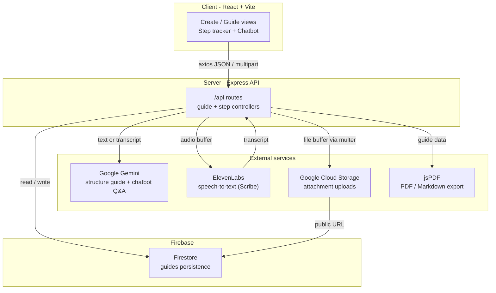

[](https://github.com/mahesh-dilip/guide-tracker-app/actions/workflows/ci.yml)

# Guide Tracker

**Turn any text or voice recording into a structured, step-by-step guide you can follow, annotate, ask questions about, and export.**

Guide Tracker takes raw content — a pasted recipe, a tutorial transcript, a voice memo dictated on your phone — and uses Google Gemini to structure it into chapters and trackable steps. As you work through a guide you can tick off steps (with live progress tracking), attach notes and photos to any step, ask a context-aware AI chatbot questions about what you're doing, and export the whole thing to PDF or Markdown. Audio uploads (including iPhone `.m4a`/`.mp4` recordings) are transcribed with ElevenLabs speech-to-text before being structured.

## Architecture



## How it works

- **Create a guide (text):** `POST /api/guides/from-text` sends raw text to `geminiService.getStructuredGuide()`, which prompts **Gemini 1.5 Flash** to translate (if needed), categorize (`RECIPE`, `TECHNICAL_TUTORIAL`, `DIY_PROJECT`, `STUDY_GUIDE`, or `GENERAL`), and return JSON of chapters and steps. Recipes additionally get a structured `ingredients` list. The result is saved to **Firestore** with UUIDs assigned to each chapter and step.
- **Create a guide (voice):** `POST /api/guides/from-audio` accepts an audio file via **multer** (in-memory, 25 MB limit). `elevenLabsService.transcribeAudio()` sends the buffer to **ElevenLabs** (`scribe_v1` speech-to-text), then the transcript flows through the same Gemini structuring path. The upload accepts iPhone-friendly formats (`.m4a`, `.mp4`, plus `.mp3`, `.wav`, `.webm`, etc.).
- **Follow & track:** `GET /api/guides/:id` loads a guide. `PUT .../steps/:stepId/complete` toggles step completion and recomputes overall progress server-side.
- **Annotate:** `POST .../steps/:stepId/notes` adds a note. `POST .../steps/:stepId/attachments` uploads a file (multer) to **Google Cloud Storage** via the Firebase Admin Storage bucket, makes it public, and stores the resulting URL on the step.
- **Ask the AI:** `POST /api/guides/:id/ask` packages the original transcript, the structured guide, and the user's current step into a context prompt for `geminiService.askAboutGuide()`, returning a grounded answer. The floating chatbot lives in `client/src/components/Chatbot.jsx`.
- **Export:** `GET /api/guides/:id/export?format=pdf|markdown` renders the guide — including step checkboxes, notes, and attachment links — to a PDF (via **jsPDF** in `exportService.js`) or a Markdown file.

State is kept entirely in a single Firestore document per guide; there is no auth yet (guides are created under a placeholder `ownerId`).

## Tech stack

| Layer | Tech |
|-------|------|
| Client | React 19, Vite 6, React Router 7, Tailwind CSS, Radix UI, lucide-react, axios |
| Server | Node.js (ESM), Express 4, multer |
| AI | Google Gemini 1.5 Flash (`@google/generative-ai`), ElevenLabs speech-to-text (`@elevenlabs/elevenlabs-js`) |
| Data / storage | Firebase Admin — Firestore + Cloud Storage |
| Export | jsPDF (PDF), custom Markdown serializer |

## Local setup

**Prerequisites:** Node.js 18+, a Google Gemini API key, an ElevenLabs API key, and a Firebase project (Firestore + Storage enabled) with a downloaded service-account key.

### 1. Server

```bash
cd server
npm install
cp .env.example .env          # fill in GEMINI_API_KEY and ELEVENLABS_API_KEY
# Download your Firebase service-account key and save it as:
#   server/serviceAccountKey.json   (gitignored)
# Update the storageBucket in services/firebaseService.js to your own project.
node server.js                # starts the API on http://localhost:8000
```

### 2. Client

```bash
cd client
npm install
cp .env.example .env          # leave VITE_API_BASE_URL empty for local dev
npm run dev                   # Vite dev server on http://localhost:5175
```

In local development the client calls `/api`, which the Vite dev proxy (`client/vite.config.js`) forwards to `http://localhost:8000`. For production, set `VITE_API_BASE_URL` to your deployed backend origin.

> **Security note:** A Firebase service-account key was committed earlier in this repo's history (it has since been revoked and removed from tracking). Never commit `serviceAccountKey.json` or `.env` files — both are gitignored.

## Screenshots

<!-- SCREENSHOTS -->
